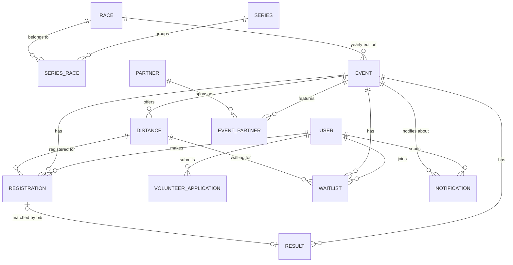

# Схема БД — Peloton Ridder

Итог обсуждений в `docs/roadmap.md` (T2) и `docs/reglaments-summary.md`. Стек: PostgreSQL + Prisma.
Синтаксис ниже — Prisma-подобный псевдокод, напрямую переносится в `schema.prisma` на T3.

## Диаграмма связей



## Ключевые решения (зачем так, а не иначе)

- **`Race` ≠ `Series`.** `Race` — вечнозелёный шаблон отдельного забега (Radon Race, Ridder UpHill...). `Series` — «Ridder Race Series» как отдельная сущность (уже реальный бренд клуба, @ridderraceseries в Instagram), связана с нужными `Race` через `SeriesRace`. Ski Summer Fest просто не участвует в этой связке. Модель выдержит появление второй серии в будущем без переделки.
- **`Event` — годовое издание, не шаблон.** У `Race` может быть сколько угодно `Event` (2026, 2027...), каждый видится и архивируется независимо.
- **`Distance.discipline`** — nullable-поле, а не отдельная сущность. Нужно только Ridder UpHill (4 дисциплины × 2-3 дистанции), у остальных остаётся `null`. Возрастные тарифы внутри одной дистанции (напр. Скайраннинг 7км: 14-16/16+/семья) — это отдельные строки `Distance`, не отдельная таблица тарифов.
- **`Registration`/`Waitlist` хранят `eventId` явно**, хотя технически выводимо через `distanceId → Distance.eventId` — ради простых запросов (рассылка по событию T35, админ-дашборд).
- **Результаты объединены в одну таблицу `Result`** независимо от источника — автопарсинг live.myrace.info (сейчас подтверждено только для Radon Race) или ручная Excel-загрузка в админке (для событий, публикующих только в Instagram — Ridder UpHill и, вероятно, остальные). Матчинг с `Registration` — по `bibNumber` внутри одного `Event`. **Открытый вопрос:** это работает только если физический номер на груди участника — это ровно тот номер, который выдала наша система при регистрации, а не независимый номер от таймингового провайдера. Нужно подтвердить у организаторов.
- **Пулы стартовых номеров** (`bibRangeStart`/`bibRangeEnd`) задаются на `Distance` при создании `Event`. В форме создания — дефолтные значения (1-100/101-200/201-300/301-400/401-500), admin может переопределить произвольно. Это поведение формы, не часть схемы.
- **Роли — плоские булевы флаги** (`isAdmin`, `isVolunteer`), без RBAC-матрицы: 3-4 админа с одинаковыми правами.
- **Волонтёрство — заявка поверх аккаунта бегуна**, не отдельная регистрация. `VolunteerApplication.status` управляет `User.isVolunteer`.

## Сущности

```
User {
  id            String   @id
  email         String   @unique
  emailVerified DateTime?
  phone         String?
  name          String
  city          String?
  isAdmin       Boolean  @default(false)
  isVolunteer   Boolean  @default(false)
  createdAt     DateTime @default(now())
}

VolunteerApplication {
  id               String   @id
  userId           String   -> User
  status           Enum(PENDING, APPROVED, REJECTED) @default(PENDING)
  motivation       String
  availability     String
  createdAt        DateTime @default(now())
  reviewedByUserId String?  -> User
  reviewedAt       DateTime?
}

Series {
  id          String @id
  name        String   // "Ridder Race Series"
  description String?
}

Race {
  id           String  @id
  slug         String  @unique
  name         String  // "Radon Race", "Ridder UpHill", "Panorama Fall Run", "Ski Summer Fest"
  courseIntro  String  // вечнозелёное описание трассы
  equipment    Json    // список обязательного снаряжения, из регламентов
  landmarks    Json    // ориентиры на трассе (текст+фото), не нужен отдельной таблицей
  icon         String
  color        String
}

SeriesRace {
  id         String @id
  seriesId   String -> Series
  raceId     String -> Race
  stageOrder Int          // 1, 2, 3...
}

Event {
  id                        String   @id
  raceId                    String   -> Race
  year                      Int
  dateISO                   DateTime
  status                    Enum(DRAFT, OPEN, CLOSED, COMPLETED) @default(DRAFT)
  location                  String
  transferPrice             Int?     // варьируется по событию (5000 / 15000)
  registrationDeadline      DateTime
  cancellationDeadline      DateTime
  medicalCancellationDeadline DateTime
  resultsUrl                String?  // live.myrace.info или Instagram, произвольная ссылка
  createdAt                 DateTime @default(now())
}

Distance {
  id            String   @id
  eventId       String   -> Event
  discipline    String?  // "Лыжная гонка" / "Ski tour" / "Скиальпинизм" / "Скайраннинг" — только Ridder UpHill
  name          String   // "Skyrunning 27 км", "12 км (19+)"
  km            Float
  gain          Int?     // набор высоты, м
  price         Int      // KZT — идёт напрямую в Kaspi при создании заказа
  minAge        Int?
  maxAge        Int?     // для тарифов вроде "10-13 + родитель"
  cutoffMinutes Int?
  profileData   Json?    // точки профиля высоты для графика
  bibRangeStart Int
  bibRangeEnd   Int
  createdAt     DateTime @default(now())
}

Registration {
  id              String   @id
  userId          String   -> User
  eventId         String   -> Event
  distanceId      String   -> Distance
  status          Enum(RESERVED, PAID, CANCELLED) @default(RESERVED)
  bibNumber       Int?
  reservedUntil   DateTime?  // 20-минутный холд номера на этапе оплаты
  disqualified    Boolean  @default(false)
  kaspiOrderId    String?
  kaspiPaymentUrl String?
  createdAt       DateTime @default(now())
}

Waitlist {
  id          String   @id
  userId      String   -> User
  eventId     String   -> Event
  distanceId  String   -> Distance
  contactNote String
  createdAt   DateTime @default(now())
}

Result {
  id             String   @id
  eventId        String   -> Event
  bibNumber      Int
  name           String   // как в источнике, для отображения и запасного матчинга
  place          Int?
  time           String?
  category       String?
  source         Enum(MYRACE, EXCEL)
  registrationId String?  -> Registration  // null, если не смэтчился
  importedAt     DateTime @default(now())
}

Partner {
  id         String  @id
  name       String
  logoUrl    String
  websiteUrl String?
}

EventPartner {
  id        String @id
  eventId   String -> Event
  partnerId String -> Partner
}

TeamMember {
  id    String @id
  name  String
  role  String
  order Int
}

TrainingGroup {
  id          String @id
  title       String
  schedule    String
  description String
  order       Int
}

Notification {
  id         String   @id
  eventId    String   -> Event
  subject    String
  body       String
  sentAt     DateTime @default(now())
  sentByUserId String -> User
}
```

## Открытые вопросы (не блокируют T3, но нужно закрыть до соответствующих тикетов)

- Оплата сейчас на реквизиты (банк) или уже Kaspi Pay — подтвердить у организаторов (T14/T15)
- Физический номер на груди = номер из нашей системы, гарантированно? (нужно для матчинга Result → Registration, T20/T21)
- Лимит участников Ski Summer Fest не указан в положении
